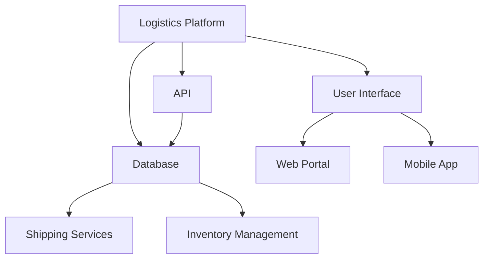

```mermaid
    graph TD;
        A[Logistics Platform] --> B[User Interface];
        A --> C[API];
        A --> D[Database];
        B --> E[Web Portal];
        B --> F[Mobile App];
        C --> D;
        D --> G[Shipping Services];
        D --> H[Inventory Management];
```